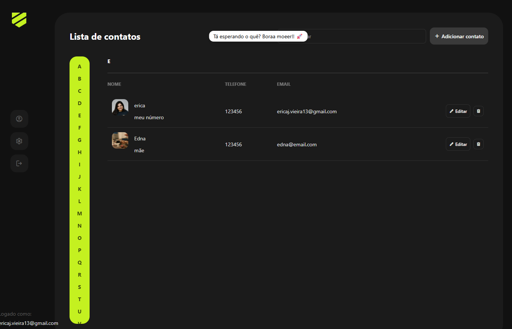
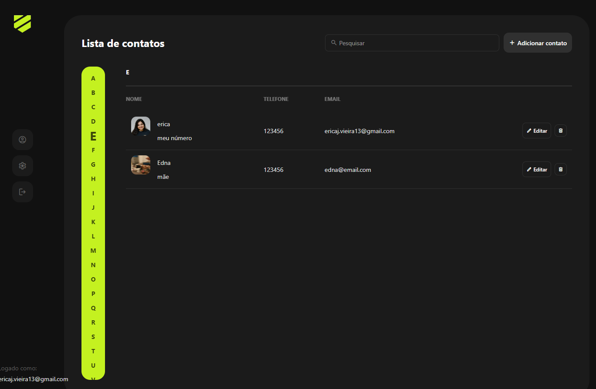
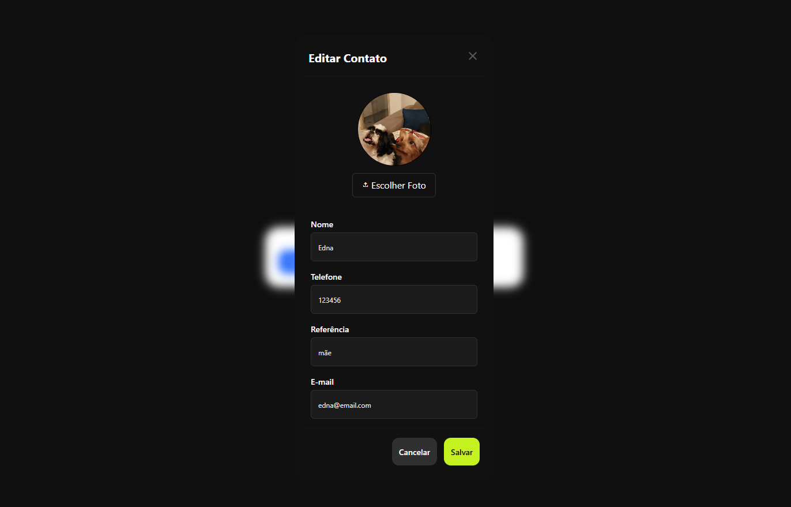
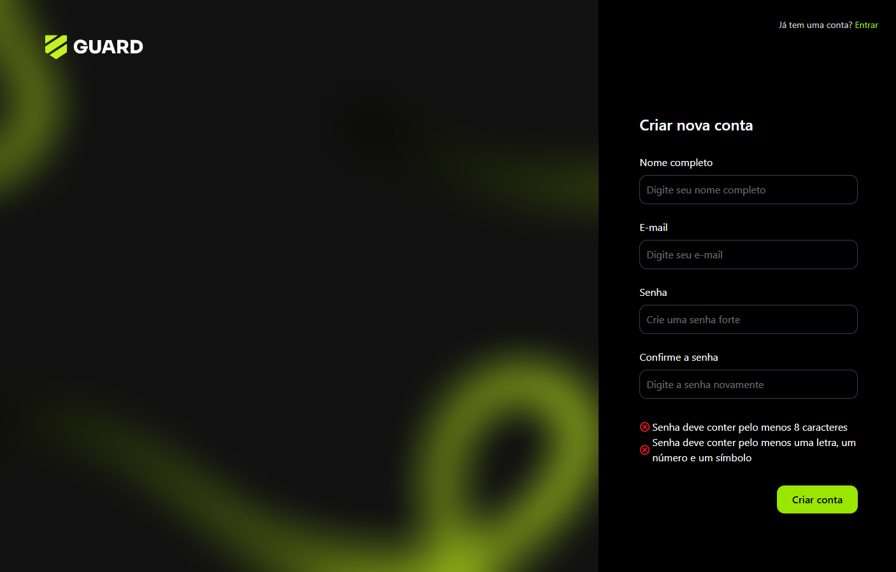

### Contact Manager App 

## Sobre o Projeto
O Contact Manager App é uma aplicação web desenvolvida com React e Tailwind CSS. Ela permite que os usuários gerenciem seus contatos de forma simples e eficiente.

---
## Começando
Para rodar o projeto localmente, siga os passos abaixo:

1. Clonar o Repositório

```bash
git clone https://github.com/ericajv/contact-manager-app.git
cd contact-manager-app
```
2. Instalar as Dependências
   
```bash
npm install
```
3. Configurar Variáveis de Ambiente

Crie um arquivo `.env` na raiz do projeto baseado no `.env.example`:

```bash
cp .env.example .env
```
4. Rodar a Aplicação

```bash
npm run dev
```

## Construção para Produção

Para gerar a versão otimizada para produção:

```bash
npm run build
```

## Tecnologias Utilizadas

- React: Biblioteca JavaScript para construção de interfaces de usuário.

- Tailwind CSS: Framework CSS utilitário para estilização rápida.

- Vite: Ferramenta de build e desenvolvimento rápido.

## Telas do Sistema



---



---


---



